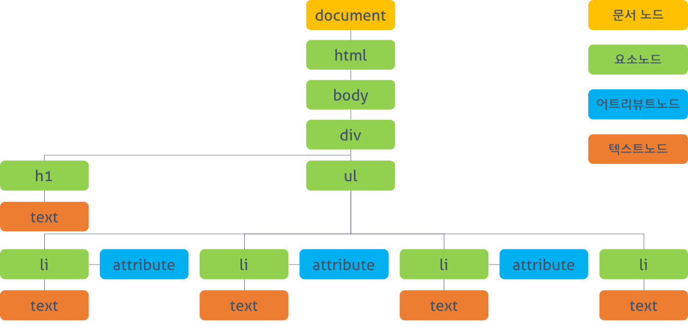

# ReactJS

ReactJS에 대해서 알아보고 기초를 배워보고 각종 미니 프로젝트를 통해서 활용법까지 익힐 예정이다.

## 1. Introduction

현재 **리액트**는 굉장히 핫한 라이브러리 중 하나입니다. **리액트**는 페이스북이 만든 사용자 UI 구축을 위한 라이브러리 입니다. 오직 사용자의 View에만 초엄을 맞추고 있죠. 현재, 개발자들이 여러가지 **리액트**에 필요한 것들을 만들어 놓아서 사실상 프레임워크 위치에 있다고 무방할 정도입니다.

**리액트**트는 3가지 대표적인 특징을 가지고 있습니다.

1.  **JSX문법**
2.  **Component 기반**
3.  **Virtual DOM**

이렇게 3가지가 있습니다. 각각에 대해서 조금씩 설명하고 이용하는 파트로 넘어가보도록 하겠습니다.

### 1.1 JSX문법

**JSX 문법**은 **자바스크립트 안에서 HTML 문법을 사용해서 view를 구성할 수 있게 도와주는 자바스크립트 문법**으로, 리액트 개발에 도움을 줍니다.

```jsx
class HelloMessage extends React.Component {
  render() {
    return <div>Hello {this.props.name}</div>;
  }
}
```

현재 자바스크립트 파일 안에서 HTML가 보입니다. 저것이 바로 **JSX**입니다.

원래 JS 안에서는 저런 문법 사용이 불가능 하지만, JSX는 이를 가능하게 해줍니다.

jsx를 사용하지 않으면 어떻게 코드가 구성이 될까요?

```js
class HelloMessage extends React.Component {
  render() {
    return React.createElement("div", null, "Hello ", this.props.name);
  }
}
```

이와 같이 복잡하게 만들어 집니다.

### 1.2 Compoenet 기반

리액트는 **컴포넌트 기반** 라이브러리 입니다. 여기서, **컴포넌트 기반**이라 함은 기존의 웹 페이지를 작성할 때 처럼 하나의 HTML코드를 집어 넣는 것이 아닌, **여러 부분을 분할해서 코드의 재사용성과 유지보수성을 증가**시켜 줍니다. **Divide and Conquer**이 가능하다는 것 입니다.

좀 더 알기 쉽게 접근하자면,

우리가 프론트를 짤 때 아주 긴 HTML 코드르 적는 경우가 있습니다. 그 코드의 일부분을 수정해야 한다고 할 때 그 부분을 찾는 것 부터 시작해서 내가 지금 수정한 코드의 부분만 수정되어야 하는데, 잘못하고 다른 부분을 건드리면 문제 해결을 하는게 아니고 도리어 문제를 키우게 됩니다.

**컴포넌트 기반인 React**로 개발을 하면 HTML코드를 부분 부분 파일로 담아서 어떤 부분을 수정해야 한다고 하면 **그 부분의 파일만 수정**하면 됩니다.

### 1.3 Virtual DOM

**가상 돔(Virtual DOM)** 은 기존 DOM의 한계를 탈피하기 위해서 나온 대안입니다.

**DOM이란?** Document Ojbect Model 단어 그대로 **문서 객체 모델**입니다. 우리가 사용하는 HTML 단위 하나하나를 객체로 생각한 모델이라고 생각하면 될 것 같다.



**이 DOM에 무슨 문제가 있을까?**

DOM의 구조는 **트리 구조**로 되어 있다. **HTML 구조와 같다.** 만약 프로그래머가 어떤 DOM의 요소를 **하나** 수정하는 함수를 만들고 실행시킬 때, **렌더 트리(Render Tree) 를 재생성하고 그러면 *모든 요소*들이 다시 계산 됩니다.**

레이아웃을 만들고 페인팅을 하는 과정이 다시 반복되는 것이다.

이게 어떤 문제가 있는가? 우리가 복잡한 SPA 개발을 통해서 DOM의 요소를 굉장히 많이 수정한다고 할 때, **불필요한 연산이 매번 일어난다는 것**이다.

> **SPA**란 Single Page Application 약자로서, 단일 페이지 어플리케이션(SPA)는 현재 웹 개발의 트렌드이다. **기존 웹 서비스**는 요청시마다 리소스들과 데이터를 해석하고 화면에 렌더링하는 방식이다. SPA형태는 브라우저에 최초에 한번 페이지 전체를 로드하고, 이후 부터는 특정 부분만 Ajax를 통해 데이터를 바인딩 하는 방식이다.

우리는 렌더트리가 매번 재생성 되는 것을 좋지 않게 생각하기 때문에, 가능하면 한번에 모든 작업이 진행되는 것을 더 선호할 것입니다.

이 문제를 해결하기 위해서 **가상 DOM**이 등장 했습니다. DOM자체가 추상화 개념인데, 거기에 한번 더 추상화를 한 것이 가상 DOM입니다.

**가상 DOM은 변화를 가상 DOM에서 미리 인지해 변화**시킵니다. 이 작업은 실제 DOM이 아니기 때문에 렌더링 되지 않고 연산 비용이 비교적 실제 DOM보다는 적습니다. **가상 DOM의 변화를 마지막에 실제 DOM에게 던져주어, 모든 변화를 한번에 렌더링 되게 합니다.**

그런데 이러한 생각은 우리는 충분히 가상 DOM을 사용하지 않고도 할 수 있었을 텐데, **왜 가상 DOM을 굳이 쓰는 것일까?**

만약 직접 DOM을 업데이트 하게 된다면 그 부분만 업데이트하기 위해서 업데이트 하지 않은 부분과 업데이트된 부분을 알고 있어야 하는데, **가상 DOM은 바뀌지 않은 부분과 바뀐 부분을 자동으로 감지해서 업데이트 시켜 줍니다.**

또한, 변경하려는 DOM이 변경되었는지, 변경되지 않았는지에 대한 각 **동기화 정보를 알고 있을 필요가 없음과 동시에 하나로 묶어서 작업**해주기 때문이다.

결론적으로 가상 DOM을 사용하는 이유는, 실제 DOM을 직접 변경할 수는 있지만, **그 작업이 굉장히 값비싼 작업이기 때문에, 가상 DOM을 미리 최적화를 한 번 해준다는 것입니다.**

## 2. Practice

이제 연습해가며, 기능들을 배워보고 익혀보자.

다음 순서로 읽으면 된다.

1.  [Basic](./main/basic.md)
2.  [Utilization](main/utilization.md)
