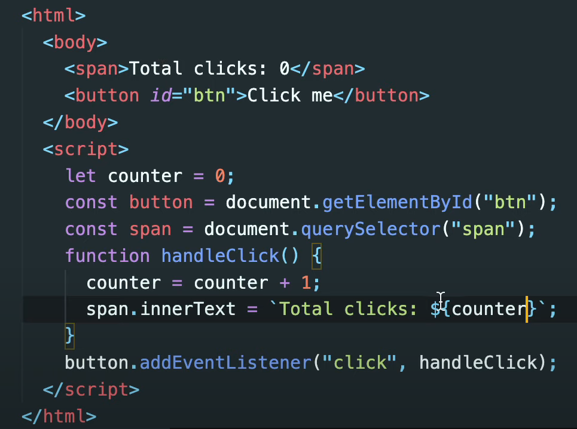

# React JS Basic

여기선, React JS의 기본적인 사용법에 대해서 알아보도록 할 것이다.

- [React JS Basic](#react-js-basic)
  - [1. SET UP](#1-set-up)
  - [2. Create Component](#2-create-component)
  - [3. useState()](#3-usestate)
    - [3.1 How to utilize usetState(Unit Conversion)](#31-how-to-utilize-usetstateunit-conversion)
      - [3.1.1 Flip Function](#311-flip-function)
    - [3.2 Devided and Conquer](#32-devided-and-conquer)
  - [4. Props(Properties)](#4-propsproperties)
    - [4.1 React Memo(Memorize)](#41-react-memomemorize)
    - [4.2 Check PropsTypes](#42-check-propstypes)

## 1. SET UP

먼저 React를 사용하기 위해서 설치를 하기 보단, 연습하는 시간이니깐 import를 해서 사용할 것이다.

개발용 배포용으로 두가지를 import를 할 수 있고, 본인은 개발용으로 import를 했다.

```js
//개발용
<script crossorigin src="https://unpkg.com/react@17/umd/react.development.js"></script>
<script crossorigin src="https://unpkg.com/react-dom@17/umd/react-dom.development.js"></script>

//배포용
<script crossorigin src="https://unpkg.com/react@17/umd/react.production.min.js"></script>
<script crossorigin src="https://unpkg.com/react-dom@17/umd/react-dom.production.min.js"></script>
```

먼저 시작하기 전에 Vanilla JS코드를 한번 보고 가자.



이 코드와 비교해서 React를 사용했을 경우 어떻게 코드를 간략하게 할 수 있는지를 확인해보자.

먼저 **React JS의 규칙 중 하나는 HTML을 페이지에 직접 작성 하지 않는 다는 것**을 알아두자.

## 2. Create Component

**컴포넌트 제작**에는 두가지 방식이 있다.

하나는 어려운 방식이며 잘 활용하지 않는 방식이고, 다른 하나는 쉬운 방식으로 실제 개발자들이 사용하는 코드이다.

쉬운 방식만 살펴보지 말고, 어려운 방식을 먼저 보고 React JS의 본질을 이해하고 넘어가자.

**React JS**와 더불어 **React-Dom**을 사용할 것인데, **React JS가 Application을 interactive**하게 만들어주는 **libary**면, **React-Dom**은 **package**로 **모든 React Element들을 HTML body**에 둘 수 있도록 해준다.

> react-dom package는 앱의 최상위 레벨에서 사용할 수 있는 DOM에 특화된 메서드와 필요한 경우 React 모델 외부로 나갈 수 있는 해결책을 제공합니다. 대다수 컴포넌트는 이 모듈을 사용할 필요가 없습니다.
>
> - render()
> - hydrate()
> - unmountComponentAtNode()
> - findDomNode()
> - createProtal()
>
> 참조: [ReactDOM – React](https://ko.reactjs.org/docs/react-dom.html)

이제 실제로 Component를 만들어 보자.

> 이번 챕터에선 HTML파일에다가 script도 같이넣어서 진행하고 있다는 것을 기억해두자.

먼저 HTML Body에 다음과 같이 해주자.

```html
<body>
  <div id="root"></div>
</body>
```

> 앞으로 이 코드는 생략되어 있는 형태로 진행 될 것이다.

Component를 만들기 위해서 사용하는 것은 **React.createElement()** 를 사용한다.

```js
const span = React.createElement("span");
ReactDOM.render(span);
```

여기서 render의 의미는 여기 React element를 가지고 HTML을 만들어 배치한다는 것이다.

사용자에게 보여주는 것이다.

render의 두번째 인자로는 어디 Element에 둘 것인지를 알려줘야 한다.

```html
<script>
  const root = document.getElementById("root");
  const span = React.createElement("span", {id: "react-span", style: {color: "red"}}, "Hello, I'm a span");
  ReactDOM.render(span, root);
</script>
```

> 보통 많이 하는 방식이 div로 id나 class를 만들어 놓고 그것을 인자로 활용한다.

여기서 **createElement**에는 인자를 한개만 둘 수 있는게 아니다. **두번째 인자로 property**를 줄 수 있고, **세번째 인자로 content**를 줄 수 있다.

다시 돌아와서 버튼을 구현해 보자.

```js
const root = document.getElementById("root");
const h3 = React.createElement("h3", null, "Hello, I'm a span");
const btn = React.createElement(
  "button",
  {
    onClick: () => console.log("I'm clicked!"),
  },
  "Click me"
);
const container = React.createElement("div", null, [h3, btn]);
ReactDOM.render(container, root);
```

이와 같이 해주면 span과 btn이 동시에 HTML에 들어가는 것을 확인할 수 있다.


여기서 주목할 점은 React JS를 이용하면서 eventListener를 위와 같이 사용할 수 있게 되었다는 점이다.

하지만, 개발자들은 createElement같은 것은 실제로 사용하지 않는다. 더 좋은 방법이 있기 때문이다.

그때 사용하는 것이 **JSX**이다.

JSX를 사용하여 작성해보자.

```jsx
const Title = (
  <h3 id="title" onMouseEnter={() => console.log("mouseEnter")}>
    Hello I'm a title
  </h3>
);
const button = (
  <button
    style={{ backgorund: "tomato" }}
    onClick={() => console.log("i'm clicked")}
  >
    Click me
  </button>
);
```

이렇게 하고나서 실행하려고 하면 오류가 난다.

오류 원인은 브라우저가 온전히 JSX를 이해하고 있는 것이 아니기 때문이다.


위의 코드를 아래 코드로 바꿔서 브라우저가 이해하도록 도와줘야 한다.

이것을 위해 사용하는 것이 Babel이다.

    <script src="https://unpkg.com/@babel/standalone/babel.min.js"></script>

해당 코드 처럼 babel을 import하고 실행하면 문제없이 실행된다.

```html
<script src="https://unpkg.com/@babel/standalone/babel.min.js"></script>
<script type="text/babel">
  const root = document.getElementById("root");
  const Title = (
    <h3 id="title" onMouseEnter={() => console.log("mouseEnter")}>
      Hello I'm a title
    </h3>
  );
  const Button = (
    <button
      style={{ background: "tomato" }}
      onClick={() => console.log("i'm clicked")}
    >
      Click me
    </button>
  );
  const container = React.createElement("div", null, [Title, Button]);
  ReactDOM.render(container, root);
</script>
```

> babel을 import하고
>
> ```html
>   <script type="text/babel">
> ```
>
> 이와 같이 type을 알려줘야 된다는 것을 알아두자. 안그러면 브라우저가 인식을 하지 못한다.

이제 Container를 JSX 문법으로 바꿔보자.

만약

    const Container = <div>Title Button</div>;

이와 같이 적어준다면 그냥 텍스트만 던져주고 있는 것이다.

그렇다면 Title과 Button을 어떻게 해야 받을 수 있을까?

그러기 위해선 **Title 과 Button을 함수**로 만들어 줘야 한다.

```jsx
const Title = () => (
  <h3 id="title" onMouseEnter={() => console.log("mouseEnter")}>
    Hello I'm a title
  </h3>
);
function Button() {
  return (
    <button
      style={{ background: "tomato" }}
      onClick={() => console.log("i'm clicked")}
    >
      Click me
    </button>
  );
}
```

> 위에는 Arrow Function을 적용한 것이고, 아래는 VanillaJS를 사용한 것이다.

이렇게 함수 형태로 만들어 준 후 다음과 같이 활용하면 된다.

```jsx
const container = (
  <div>
    <Title /> <Button />
  </div>
);
```

> **여기서 주의할 점**
>
> **컴포넌트의 첫 글자는 반드시 *대문자*여야 한다는 것**
>
> 만약 소문자면 React랑 JSX는 이것을 HTML Tag로 인식해 버린다.

최종 코드는 다음과 같다.

```jsx
const root = document.getElementById("root");
const Title = () => (
  <h3 id="title" onMouseEnter={() => console.log("mouseEnter")}>
    Hello I'm a title
  </h3>
);
function Button() {
  return (
    <button
      style={{ background: "tomato" }}
      onClick={() => console.log("i'm clicked")}
    >
      Click me
    </button>
  );
}
const Container = () => (
  <div>
    <Title /> <Button />
  </div>
);
ReactDOM.render(<Container />, root);
```

## 3. useState()

이제 **useState()** 를 사용할 것인데 이것은 **Hook**로써 위에서 봤던 counter같은 바뀌는 데이터들을 만들 수 있는 기능을 가지고 있다.

이것을 알기 위해선 **Hook**에 대한 개념을 익혀둘 필요가 있는데 해당 페이지를 읽어보고 넘어가자.

참고: [Hook의 개요 – React](https://ko.reactjs.org/docs/hooks-intro.html)

> **이것이 왜 필요할까?**
>
> 변경된 부분만 업데이트된다는 기능을 가지고 있는 **useState()**
>
> 리액트가 아닌 경우, 일반 자바스크립트를 쓴 브라우저는 Node정보가 바뀔 때마다 Node Tree를 처음부터 다시 생성한다. 무려 5단계에 걸쳐서 말이다.
>
> 근데 리액트는 **Virtual DOM**을 써서 오직 원하는 부분만 수정해서 보여주고 모든 업데이트가 끝나면 하나로 합쳐서 실제 DOM에게 건네줍니다.

어떻게 사용할까?

사용 방식은 두 가지가 있는데, 하나는 좋지 않은 방식이고, 다른 하나는 우리가 앞으로 사용할 최고의 방식이다.

코드를 통해 알아보자.

```jsx
const root = document.getElementById("root");
const Container = () => (
  <div>
    <h3>Total clicks: 0</h3>
    <button>Click me</button>
  </div>
);
ReactDOM.render(<Container />, root);
```

먼저 좋지 않은 방식을 알아보자.

먼저 해당 코드를 넣어주자.

    let counter = 0;

이제 이 변수를 JSX에 전달하는 방법을 사용할 것이다.

VanillaJS라면 이렇게 했을 것이다.

    span.innerText = `Total clicks: ${counter}`;

React에선 **변수를 전달할 때 괄호**만 열어주면 된다.

    <h3>Total clicks: {counter}</h3>

이제 countUp function을 만들어 보자.

```jsx
function countUp() {
  counter = counter + 1;
}
const Container = () => (
  <div>
    <h3>Total clicks: {counter}</h3>
    <button onClick={countUp}>Click me</button>
  </div>
);
ReactDOM.render(<Container />, root);
```

이렇게만 하면 문제가 무엇일까?

UI가 업데이트 되지 않는다.

동작 원리를 생각해보면,

우리는 **현재 컴포넌트를 단 한번만 렌더링** 하고있다. 어플리케이션을 시작할 때 말이다.

그때의 counter에 들어있는 값은 0이다.

Container의 경우 함수라서 곧바로 실행되지는 않는다.

결국 바로 실행되는 코드는

    ReactDOM.render(<Container />, root);

이 코드밖에 없다.

이 코드가 실행이 되면 Container 컴포넌트가 렌더링 될 것이고, 그 때의 코드가 React Element가 될 것이다.

**리렌더링(Re-Rendering)** 을 해줄 필요가 있다.

```jsx
const root = document.getElementById("root");
let counter = 0;
function countUp() {
  counter = counter + 1;
  render();
}
function render() {
  ReactDOM.render(<Container />, root);
}
const Container = () => (
  <div>
    <h3>Total clicks: {counter}</h3>
    <button onClick={countUp}>Click me</button>
  </div>
);
render();
```

이 방식은 우리 값을 바꿀때마다, 다시 렌더링 해줘야 한다.

이것말고 다른 방식을 사용해보자.

다시 초기 코드로 돌아가서 시작해보자.

```jsx
const root = document.getElementById("root");
const App = () => (
  <div>
    <h3>Total clicks: =</h3>
    <button>Click me</button>
  </div>
);
ReactDOM.render(<App />, root);
```

React 에선 let counter=0; 과 같은 방식 말고 도와줄 기능을 제공해준다.

바로 **useState()** 이다.

```jsx
function App() {
  const data = React.useState();
  console.log(data);
  return (
    <div>
      <h3>Total clicks: =</h3>
      <button>Click me</button>
    </div>
  );
}
```


Array를 받았는데, undefined값과 함수를 지닌 배열을 받았다.

이번엔 0이라는 값을 넣어주고 실행해보자.

```jsx
const data = React.useState(0);
console.log(data);
```


저기서 **함수의 역할은 data의 값을 바꿀 수 있는 역할을 한다.**

**useState()** 는 아까 위에서 사용했던 let counter=0;과 function counterUp()역할을 모두 수행할 수 있는 능력을 가지고 있는 것이다.

그러면 어떻게 작성해줘야 할까?

만약 저대로 사용한다면 이와같이 사용해줘야 한다.

```jsx
<h3>Total clicks: = data[0]</h3>
```

함수를 사용하려면 **data[1]** 로 헤서 접근해야 한다. 이것은 코드의 복잡성을 높인다.

그래서 우리는 JavaScript에서 제공하는 기능을 사용할 것이다.

배열에서 요소들을 꺼내서 이름을 부여해주는 기능이다.


이렇게도 할 수 있지만 좀 더 보기 좋고 짧은 코드로 할 수 있다.

    const [counter, modifier] = React.useState(0);

우리는 이와 같이 사용할 것이다.

정리해보자.

useState는 우리에게 배열을 하나 주고 요소는 이와 같다.

**첫번째 요소는 우리가 담으려는 data값**이고, **두 번째 요소는 data값을 바꿀 때 사용할 modifier**이다.

modifer는 어떻게 이용할까?

위에서 counter를 어떻게 이용하였는가?

```jsx
const root = document.getElementById("root");
function App() {
  let [counter, modifier] = React.useState(0);
  const onClick = () => {
    counter = counter + 1;
    console.log(counter);
  };
  return (
    <div>
      <h3>Total clicks: = {counter}</h3>
      <button onClick={onClick}>Click me</button>
    </div>
  );
}
ReactDOM.render(<App />, root);
```

**onClick event**를 이용하여 이와 같이 이용 하였다.

이렇게 하면 버튼을 누를 때마다 잘 작동하지만 리렌더링 작업이 필요하다.


리렌더링을 해주려면 onClick을 이와같이 해줘야 한다.

```jsx
const onClick = () => {
  counter = counter + 1;
  ReactDOM.render(<App />, root);
};
```

만약에 파일이 많거나 폼, 로그인, 알림, 비디오 플레이어 등등 여러 가지를 다룰 때 이 함수를 계속 호출하는 것은 힘들다.

counter를 업데이트하기 위해서 우리는 modifer 함수를 사용할 것이다.

**modifer함수는 인자를 하나 받는다.** 어떤 값을 주던 modifier 함수는 **그 값으로 업데이트**하고 **리렌더링**을 해준다.

코드로 보자.

```jsx
const root = document.getElementById("root");
function App() {
  let [counter, setCounter] = React.useState(0);
  const onClick = () => {
    setCounter(counter + 1);
  };
  return (
    <div>
      <h3>Total clicks: = {counter}</h3>
      <button onClick={onClick}>Click me</button>
    </div>
  );
}
ReactDOM.render(<App />, root);
```

현재 setCounter는 아래 두 코드의 역할을 동시에 수행하고 있는 것이다.

```jsx
counter = counter + 1;
ReactDOM.render(<App />, root);
```

State를 바꾸는 방법은 2가지가 있다.

1. 직접 값을 설정 => setCounter(counter + 1);
2. 함수를 전달 하기 => setCounter((current) => current + 1);

선택적으로 활용하면 되지만, 되도록이면 2번째 방식을 사용하자. 함수를 사용할 상황이 더 많을 것이다.

> modifier안에 사용하는 함수의 첫 번째 arguemnt는 현재 값이다.

### 3.1 How to utilize usetState(Unit Conversion)

단위 변환(Unit Conversion)앱을 만들어 볼 것이다.

```jsx
function App() {
  return (
    <div>
      <h3>Super Converter</h3>
    </div>
  );
}
const root = document.getElementById("root");
ReactDOM.render(<App />, root);
```

해당 코드로부터 시작을 해보자.

먼저 분을 시간단위로 바꾸는 것부터 해볼 것이다.

```jsx
<h3>Super Converter</h3>
<input placeholder="Minutes" type="number" />
<input placeholder="Hours" type="number" />
```

Minutes에다가 분을 쓰면 시 단위가 갱신될 것이고, Hours라고 되어 있는 부분에 시간을 쓰면 분단위가 갱신되게 만들 예정이다.

```jsx
function App() {
  const [minutes, setMinutes] = React.useState();
  return (
    <div>
      <h3>Super Converter</h3>
      <label htmlFor="minutes">Minutes </label>
      <input value={minutes} id="minutes" placeholder="Minutes" type="number" />
      <label htmlFor="hours">Hours </label>
      <input id="hours" placeholder="Hours" type="number" />
    </div>
  );
}
const root = document.getElementById("root");
ReactDOM.render(<App />, root);
```

> **주의할 점**
>
> JSX 문법은 HTML문법과 완전 같은 문법인 것은 아니다. label을 봐보자.
>
> 원래라면 label에 쓰는 것은 htmlFor이 아닌 for이다. 만약 for을 사용하면 어떻게 되는 지 확인해보자.
>
> 
>
> 이것은 for뿐만이 아니라 class도 동일하다. class를 줘도 오류가 난다.
>
> JavaScript에는 for이란 용어도 있고, class라는 용어도 이미 사용 중이다.
>
> 따라서 **for은 htmlFor로, class는 className으로 사용**해야 한다.

추가적으로 알아둬야 할 것은 React JS에서는 input은 uncontrolled라고 알려져 있다.

그 말은 즉, input의 value는 우리가 통제할 수 없다는 것이다.

그래서 useState를 만들어 주고 그것을 활용한 것이다.

이제 내가 해야 할 것은 사용자가 input에 값을 입력할 때 마다 value를 업데이트 해줘야 한다.

그때 사용하는 Event는 **change**이다.

```jsx
function App() {
  const [minutes, setMinutes] = React.useState();
  const onChange = (event) => {
    console.log(event.target.value);
  };
  return (
    <div>
      <h3>Super Converter</h3>
      <label htmlFor="minutes">Minutes </label>
      <input
        value={minutes}
        id="minutes"
        placeholder="Minutes"
        type="number"
        onChange={onChange}
      />
      <label htmlFor="hours">Hours </label>
      <input id="hours" placeholder="Hours" type="number" />
    </div>
  );
}
const root = document.getElementById("root");
ReactDOM.render(<App />, root);
```

이와 같이하고 결과를 보자.


이제 value를 가지고 있으니 이걸 minutes에 넣어주면 된다.

```jsx
const onChange = (event) => {
  setMinutes(event.target.value);
};
```

여기서 만약 onchange 를 지우고 defalut값으로 minutes에 0을 주면 어떻게 될까?

```jsx
const [minutes, setMinutes] = React.useState(0);
...
<input
  value={minutes}
  id="minutes"
  placeholder="Minutes"
  type="number"
/>
...
```

이렇게 하면 Frontend에 가서 input에 숫자를 입력하려고 해도 아무것도 써지지 않는다.

이유가 무엇일까?

**Input의 value가 State**이고, 이 **State의 default값이 0**이기 때문이다.

이제 여기에 reset버튼을 눌렀을 때 minutes이 0이 되게 할 것이고 Hours의 input에도 attributes를 주자.

> Property와 Attribute 차이
>
> - **attribute**는 HTML 문서에서의 정적인 속성
> - **property**는 HTML DOM에서의 동적인 속성
>
> 참고: [attribute와 property의 차이점](https://velog.io/@kysung95/%EC%A7%A4%EB%A7%89%EA%B8%80-attribute%EC%99%80-property%EC%9D%98-%EC%B0%A8%EC%9D%B4%EC%A0%90)

최종 코드는 이와 같다.

```jsx
function App() {
  const [minutes, setMinutes] = React.useState(0);
  const onChange = (event) => {
    setMinutes(event.target.value);
  };
  const reset = () => setMinutes(0);
  return (
    <div>
      <h1>Super Converter</h1>
      <div>
        <label htmlFor="minutes">Minutes </label>
        <input
          value={minutes}
          id="minutes"
          placeholder="Minutes"
          type="number"
          onChange={onChange}
        />
      </div>
      <div>
        <label htmlFor="hours">Hours </label>
        <input
          value={minutes / 60}
          id="hours"
          placeholder="Hours"
          type="number"
          disabled
        />
      </div>
      <button onClick={reset}>Reset</button>
    </div>
  );
}
const root = document.getElementById("root");
ReactDOM.render(<App />, root);
```

구현 영상은 이와 같다.


#### 3.1.1 Flip Function

이번엔 반대로 입력을 할 수 있도록 만들어 보도록 하자.

Hours를 입력하면 Minutes으로 나오게 하는 단위 변환 Flip function을 구현해보자.

코드를 분석하면서 알아보자.

```jsx
function App() {
  const [minutes, setMinutes] = React.useState(0);
  const [flipped, setFlipped] = React.useState(false);
  const onChange = (event) => {
    setMinutes(event.target.value);
  };
  const reset = () => setMinutes(0);
  const onFlip = () => setFlipped(!flipped);
  return (
    <div>
      <h1>Super Converter</h1>
      <div>
        <label htmlFor="minutes">Minutes </label>
        <input
          value={minutes}
          id="minutes"
          placeholder="Minutes"
          type="number"
          onChange={onChange}
          disabled={flipped === true}
        />
      </div>
      <div>
        <label htmlFor="hours">Hours </label>
        <input
          value={minutes / 60}
          id="hours"
          placeholder="Hours"
          type="number"
          disabled={flipped === false}
        />
      </div>
      <button onClick={reset}>Reset</button>
      <button onClick={onFlip}>Flip</button>
    </div>
  );
}
```

먼저 flipped이 담긴 useState를 만들어 주도록 하고, Flip버튼을 구현했다.

그리고 Flip버튼을 눌렀을 때 이벤트가 발생하게 하여, Flip의 boolean값을 바꿔줬다.

그래서 Minutes와 Hours의 disabled값을 바꿔주는 방식으로 코드를 구성해 놓은 것이다.

아까 위해서도 말했듯이 **modifier을 이용해서 함수형태가 아닌 직접적으로 바꾸는 것은 좋지 않다고 했다**. 아래와 같이 코드를 짜주는 것이 더 좋다.

    const onFlip = () => setFlipped((current) => !current);

그리고 disabled부분도 코드를 줄일 수 있다.

    {flipped === true} => {flipped}
    {flipped === false} => {!flipped}

이와 같이 하면 된다.

이제 Hours input의 change event를 listening해줘야 한다.

내가 만약 Hours input에다가 onchange={onChnage} 속성을 추가한다면 어떻게 될까?

숫자로 써도 보이는건 내가 입력한 값이 아닌 변환된 값 value={minutes / 60} 이 **변환된 value**로 보인다.

이 부분을 수정할 필요가 있다.

Flip버튼을 눌렀을 때 변환 공식도 변경 되면서 value의 값도 수정되어야 되는 것이다.

무엇을 사용해야 될까?

Flip버튼을 클릭하면 flipped의 boolean값이 변경되고, 우리가 원하는건 Flip버튼을 클릭했을 때 value 적용 방법이 바뀌는 것을 원한다.

조건문 거기서도 **삼항 연산자**를 활용하면 된다.

```jsx
function App() {
  const [amount, setAmount] = React.useState(0);
  const [flipped, setFlipped] = React.useState(false);
  const onChange = (event) => {
    setAmount(event.target.value);
  };
  const reset = () => setAmount(0);
  const onFlip = () => {
    reset();
    setFlipped((current) => !current);
  };
  return (
    <div>
      <h1>Super Converter</h1>
      <div>
        <label htmlFor="minutes">Minutes </label>
        <input
          value={flipped ? amount * 60 : amount}
          id="minutes"
          placeholder="Minutes"
          type="number"
          onChange={onChange}
          disabled={flipped}
        />
      </div>
      <div>
        <label htmlFor="hours">Hours </label>
        <input
          value={flipped ? amount : Math.round(amount / 60)}
          id="hours"
          placeholder="Hours"
          type="number"
          disabled={!flipped}
          onChange={onChange}
        />
      </div>
      <button onClick={reset}>Reset</button>
      <button onClick={onFlip}>Flip</button>
    </div>
  );
}
const root = document.getElementById("root");
ReactDOM.render(<App />, root);
```

여기서 onFlip안에 reset()넣어준 이유는 안 넣었을 때 input의 입력값이 남아있으면서 숫자가 바뀌어 버리기 때문이다.

Flip을 하는순간 value의 적용 방식이 다르기 때문에 value에 값이 남아있으면 숫자도 바뀐다.

### 3.2 Devided and Conquer

이제 마무리 연습으로 메뉴바를 만들어서 변환기를 선택할 수 있게 해줄 것이고,

분/시간 변환기나 마일/킬로미터 변환기를 사용자가 고를 수 있게 해주려고 한다.

이것은 위에서 했던 반복이라서 최종 코드만 남겨두겠다.

```jsx
function MinutesToHours() {
  const [amount, setAmount] = React.useState();
  const [inverted, setInverted] = React.useState(false);
  const onChange = (event) => {
    setAmount(event.target.value);
  };
  const reset = () => setAmount("");
  const onInverted = () => {
    reset();
    setInverted((current) => !current);
  };
  return (
    <div>
      <div>
        <label htmlFor="minutes">Minutes </label>
        <input
          value={inverted ? amount * 60 : amount}
          id="minutes"
          placeholder="Minutes"
          type="number"
          onChange={onChange}
          disabled={inverted}
        />
      </div>
      <div>
        <label htmlFor="hours">Hours </label>
        <input
          value={inverted ? amount : Math.round(amount / 60)}
          id="hours"
          placeholder="Hours"
          type="number"
          disabled={!inverted}
          onChange={onChange}
        />
      </div>
      <button onClick={reset}>Reset</button>
      <button onClick={onInverted}>{inverted ? "Turn back" : "Invert"}</button>
    </div>
  );
}
function KmToMiles() {
  const [amount, setAmount] = React.useState("");
  const [inverted, setInverted] = React.useState(false);
  const onChange = (event) => {
    setAmount(event.target.value);
  };
  const reset = () => setAmount("");
  const onInverted = () => {
    reset();
    setInverted((current) => !current);
  };
  return (
    <div>
      <h3> KM To Milse</h3>
      <div>
        <label htmlFor="km">KM </label>
        <input
          value={inverted ? Math.round(amount / 0.62137) : amount}
          id="km"
          type="number"
          placeholder="KM"
          onChange={onChange}
          disabled={inverted}
        />
      </div>
      <div>
        <label htmlFor="miles">Miles</label>
        <input
          value={inverted ? amount : Math.round(amount * 0.62137)}
          id="miles"
          type="number"
          placeholder="Miles"
          onChange={onChange}
          disabled={!inverted}
        />
      </div>
      <button onClick={reset}>Reset</button>
      <button onClick={onInverted}>Invert</button>
    </div>
  );
}

function App() {
  const [index, setIndex] = React.useState("xx");
  const onSelect = (event) => {
    setIndex(event.target.value);
  };
  return (
    <div>
      <h1>Super Converter</h1>
      <select onChange={onSelect}>
        <option value="xx">Select your units</option>
        <option value="0">Minutes & Hours</option>
        <option value="1">Km & Miles</option>
      </select>
      <hr />
      {index === "xx" ? "Please Select your units." : null}
      {index === "0" ? <MinutesToHours /> : null}
      {index === "1" ? <KmToMiles /> : null}
    </div>
  );
}
const root = document.getElementById("root");
ReactDOM.render(<App />, root);
```

이 로직에서 봐야될 것은 코드를 isolation과 encapsulation을 적용시켜서 이 모든 JSX를 말 그대로 분리된 컴포넌트로 나누고 그것을 활용했다는 것이다.

## 4. Props(Properties)

**Props는 속성을 나타내는 데이터**입니다. **부모 컴포넌트가 자식 컴포넌트에 값을 전달할 때 사용합니다.**
**Components**와 **Props**를 같이 살펴볼 필요가 있는데 다음 페이지를 참고하자.

참고: [Components와 Props – React](https://ko.reactjs.org/docs/components-and-props.html)

다시 아래코드 부터 시작을 해보자.

```jsx
  <script type="text/babel">
    function App() {
      return <div></div>;
    }
    const root = document.getElementById("root");
    ReactDOM.render(<App />, root);
  </script>
```

Props를 이해하기 위해서, 왜 필요한 지를 보기 위해서 우리는 Props로 해결이 가능한 문제를 살펴볼 것이다.

먼저 각각 버튼마다 컴포넌트를 만들어 볼 것이다.

```jsx
function SaveBtn() {
  return <button>Save Changes</button>;
}
function ConfirmBtn() {
  return <button>Confirm</button>;
}
function App() {
  return (
    <div>
      <SaveBtn />
      <ConfirmBtn />
    </div>
  );
}
const root = document.getElementById("root");
ReactDOM.render(<App />, root);
```

> \<SaveBtn /> 이러한 것을 함수형 컴포넌트라고 부른다.

내가 만약 여기서 button들에게 style을 주려고 하면 어떻게 줄 수 있을까?

```jsx
<button
  style={{
    backgroundColor: "tomato",
    color: "white",
    padding: "10px 20px",
    border: 0,
    borderRadius: 10,
  }}
>
  Save Changes
</button>
```

먼저 위에 Save Btn에 이와 같은 styles를 부여해줬다.

그러면 Confirm Btn에 같은 styles를 부여하고 싶다면?

style을 복사 붙여넣기 해야 될까?

이것은 최선의 방법은 아니다.

만약 저기서 styles까지 동일하다면 결국 Save Btn과 Confirm Btn의 차이점은 안에 들어가는 text만 차이가 있을 뿐이다.

**그렇다면, 변수로써 활용할 수 있으면 좋지 않을까?**

```jsx
function Btn() {
  return (
    <button
      style={{
        backgroundColor: "tomato",
        color: "white",
        padding: "10px 20px",
        border: 0,
        borderRadius: 10,
      }}
    >
      Save Changes
    </button>
  );
}
function App() {
  return (
    <div>
      <Btn text="Save Chnages" />
      <Btn text="Confirm" />
    </div>
  );
}
```

이렇게 해서 **부모 컴포넌트에서 자식 컴포넌트에 값을 전달**해주고 있다. 이때 **text가 Props**를 의미한다. 하지만 컴포넌트에서 text를 활용하고 있지 않다.

```jsx
function Btn(props) {
  return (
    <button
      style={{
        backgroundColor: "tomato",
        color: "white",
        padding: "10px 20px",
        border: 0,
        borderRadius: 10,
      }}
    >
      {props.text}
    </button>
  );
}
```

> **컴포넌트에서 건네줄 수 있는 Argument(인자)는 하나**이다.

여기서 저 props를 만약 많이 사용해야되고 코드가 길어진다면?

props.key 이러한 식으로 계속해서 써야 될텐데 가독성도 좋지 않고, 불편하다.

그래서 개발자들이 활용하는 방법이 있다. Props는 결국 Object이기 때문에 미리
**"{}"** 중괄호를 여는 것이다.

```jsx
function Btn({ text, big }) {
  return (
    <button
      style={{
        backgroundColor: "tomato",
        color: "white",
        padding: "10px 20px",
        border: 0,
        borderRadius: 10,
        fontSize: big ? 18 : 16,
      }}
    >
      {text}
    </button>
  );
}
```

만약 Props를 style이나 onClick function을 넣어준다면?

```jsx
    function App() {
      const [value, setValue] = React.useState("Save Changes");
      const changeValue = () => setValue("Revert Changes");
      return (
        <div>
          <Btn text={value} style={{color:"green"} changeValue={changeValue} />
          <Btn text="Confirm" />
        </div>
      );
    }
```

현재 onClick은 Props로 들어간 것이다.

컴포넌트에는 style도 event lisenter도 적용되지 않을 것이다.

직접적으로 코드에 달린 것이 아니기 때문이다. 그래서 컴포넌트에서 받은 Props로 함수안에서 직접 활용해야 한다.

```jsx
function Btn({ text, changeValue }) {
  return (
    <button
      onClick={changeValue}
      style={{
        backgroundColor: "tomato",
        color: "white",
        padding: "10px 20px",
        border: 0,
        borderRadius: 10,
        fontSize: big ? 18 : 16,
      }}
    >
      {text}
    </button>
  );
}
```

### 4.1 React Memo(Memorize)

버튼이 언제 그려지는지 확인해보기 위해서 이와 같이 해줬다.

```jsx
function Btn({ text, onClick }) {
  console.log(text, "was rendered");
  return (
    <button
      onClick={onClick}
      style={{
        backgroundColor: "tomato",
        color: "white",
        padding: "10px 20px",
        border: 0,
        borderRadius: 10,
        fontSize: 16,
      }}
    >
      {text}
    </button>
  );
}
function App() {
  const [value, setValue] = React.useState("Save Changes");
  const changeValue = () => setValue("Revert Changes");
  return (
    <div>
      <Btn text={value} onClick={changeValue} />
      <Btn text="Confirm" />
    </div>
  );
}
const root = document.getElementById("root");
ReactDOM.render(<App />, root);
```


실행 시키고 버튼을 한번 누른 것 까지 console창에 뜬 것이다.

어떤 부분이 Btn Confirm을 다시 그려주고 있는 것일까?

**Btn Confirm은 변경된 것이 없는데 다시 그리고 있다.** 버튼을 누른다고 해도 Confirm Btn에는 변동이 없다.

**React JS규칙에 따라 우리는 컴포넌트가 상태를 바꾼다면 다시 render**하는 것을 알고 있다.

이 경우 **부모 컴포넌트가 state를 변경하고 있고 그려면 App()에 있는 모든게 다시 그려지고 있는 것**이다.

Btn Confirm에게 Props가 변경되지 않으면 Re-Render하지 않게 해주고 싶다.

그때 사용하는 것이 **React Memo(Memorize)** 이다.

```jsx
const MemorizeBtn = React.memo(Btn);
function App() {
        ...
        <Btn text={value} onClick={changeValue} />
        <Btn text="Confirm" />

                      ↓

        <MemorizeBtn text={value} onClick={changeValue} />
        <MemorizeBtn text="Confirm" />
        ...
]
```

위의 Btn을 MemorizeBtn으로 바꿔준 것이고 결과를 확인해보자.


버튼을 눌러도 Confirm Btn은 Re-Rendering이 되지 않은 것을 확인할 수 있다.

### 4.2 Check PropsTypes

앱이 커짐에 따라 **타입 검사를 활용하면 많은 버그(bug)** 를 잡을 수 있다.

자세한 내용은 아래 페이지를 참고하고 이용법을 알아보자.

참고: [PropTypes와 함께 하는 타입 검사 – React](https://ko.reactjs.org/docs/typechecking-with-proptypes.html)

하나 예시를 보자.

위에서 사용한 Btn 코드에서 계속 이어갈 것인데, 만약 협업을 하고 있고 팀원들 중에 실수로 Props에 들어갈 값을 잘못 넣어줬다고 해보자.

```jsx
    <Btn text={value} fontSize={18} />
    <Btn text={18} fontSize={"continue"} />
```

이렇게 받아왔을 때 **Props Type을 검사하지 않으면 오류가 나지 않아서 머가 문제인지 해결하기 어렵다.**

**PropType은 어떤 타입의 Prop을 받고 있는지 체크해준다.**

    <script src="https://unpkg.com/prop-types@15.7.2/prop-types.js"></script>

해당 코드를 import해주고 다음과 같이 코드를 짜주자.

```jsx
function Btn({ text, fontSize }) {
  console.log(text, "was rendered");
  return (
    <button
      style={{
        backgroundColor: "tomato",
        color: "white",
        padding: "10px 20px",
        border: 0,
        borderRadius: 10,
        fontSize: { fontSize },
      }}
    >
      {text}
    </button>
  );
}
Btn.propTypes = {
  text: propTypes.string,
  fontSize: propTypes.number,
};
```


type검사 뿐만이 아니라 isrequired와 같은 것으로 argument를 건제주지 않을 때도 확인 할 수 있다.

```jsx
Btn.propTypes = {
  text: PropTypes.string,
  fontSize: PropTypes.number.isRequired,
};
function App() {
  const [value, setValue] = React.useState("Save Changes");
  const changeValue = () => setValue("Revert Changes");
  return (
    <div>
      <Btn text={value} fontSize={18} />
      <Btn text={"confirm"} />
    </div>
  );
}

function Btn({ text, fontSize = 16 }) {
  console.log(text, "was rendered");
  return (
    <button
      style={{
        backgroundColor: "tomato",
        color: "white",
        padding: "10px 20px",
        border: 0,
        borderRadius: 10,
        fontSize: { fontSize },
      }}
    >
      {text}
    </button>
  );
}
Btn.propTypes = {
  text: PropTypes.string.isRequired,
  fontSize: PropTypes.number,
};
function App() {
  const [value, setValue] = React.useState("Save Changes");
  return (
    <div>
      <Btn text={value} fontSize={18} />
      <Btn text={"confirm"} />
    </div>
  );
}
const root = document.getElementById("root");
ReactDOM.render(<App />, root);
```
