# Utilization

## 1. Create React App

먼저 Create React App을 보자.

Create React App은 React 배우기에 간편한 환경이다. 그리고 시작하기에 최고의 방법은 새로운 싱글 페이지 애플리케이션이다.

참고: [새로운 React 앱 만들기 – React](https://ko.reactjs.org/docs/create-a-new-react-app.html)

이전 까지 React를 이용할 때 여러 기능을 사용하기 위해 import을 해왔는데, Create React App을 이용하면 엄청나게 많은 스크립트들과 많은 사전설정들을 해준다.

기본적으로 node.js가 설치되어 있어야 된다.

    npx create-react-app (어플리케이션 이름)

예를 들면 내 어플리케이션 이름은 react-for-beginners이니깐

    npx create-react-app react-for-beginners

이와 같이 입력을 했다.

설치가 다 되면 vscode를 열고 CLI에 npm start를 치면 development server를 만들게 될 것이다.

기초부터 시작할 것이기 때문에 src에 index.js와 APP.js외엔 전부 지웠다.

```jsx
//App.js

function App() {
  return (
    <div>
      <h1>Welcome back!</h1>
    </div>
  );
}

export default App;

//index.js

import React from "react";
import ReactDOM from "react-dom/client";
import App from "./App";

ReactDOM.render(
  <React.StrictMode>
    <App />
  </React.StrictMode>,
  document.getElementById("root")
);
```

이제 우리가 이전 챕터에서 했던 Btn을 구현하면서 잘 적용되는지 확인하고 넘어가자. 이번엔 index.html에 만드는 것이 아닌 **컴포넌트 자체를 js파일로 만들어서 사용할 것이다.**

```jsx
// Button.js

function Button({ text }) {
  return <button>{text}</button>;
}

export default Button;

// App.js

import Button from "./Button";

function App() {
  return (
    <div>
      <h1>Welcome back!!!</h1>
      <Button text={"Continue"} />
    </div>
  );
}

export default App;
```

이제 Props Type검사를 하기위해 Prop-Types를 설치해주자.

    npm i prop-types

> **주의**
>
> prop-types 설치 시 npm audit fix 라는 명령어가 눈에 띌 수 있다.
> npm v6 이후에 나온 기능이며 이는 모듈의 취약점을 검사해준다.
> 아무런 고민 없이 그럼 더 좋은거 아냐? 하고 명령어를 치는 순간 잘 동작하던 프로젝트가 정상 동작하지 않을 수 있다. 아무런 생각없이 터미널에 보이는 내용을 따라하진 말자.

```jsx
// Button.js

import PropTypes from "prop-types";

function Button({ text }) {
  return <button>{text}</button>;
}

Button.prototype = {
  text: PropTypes.string.isRequired;
}

export default Button;
```

> Create-React-App을 사용하면 우리가 이전에 사용했던 **React.useState()** 를 **usetState()** 를 적어서 사용할 수 있다. 즉 이제 React를 적어줄 필요가 없다.
>
> 단지 **useState**를 import해주면 된다.

## 2. How to use CSS

Create-React-App으로 작업할 때 CSS를 적용하는 방법은 두 가지가 있다.

먼저 첫번째, **css파일을 만들어서 import해주는 것**이다.

```css
/* src/styles.css */

button {
  color: white;
  background-color: tomato;
}
```

이것을 사용하고 싶다면 index로 가서 import를 해주면 된다.

```jsx
index.js

...

import "./styles.css";

...
```

하지만 이렇게 한다면 모든 버튼들이 해당 CSS를 적용해버리는 문제가 있다.

두번째 방법, **CSS Module**을 사용하는 것이다.

```css
/* Button.module.css */

.btn {
  color: white;
  background-color: tomato;
}
```

```jsx
// Button.js

import PropTypes from "prop-types";
import styles from "./Button.module.css";

function Button({ text }) {
  return <button className={styles.btn}>{text}</button>;
}

Button.propTypes = {
  text: PropTypes.string.isRequired,
};

export default Button;
```

이렇게 이제 styles들도 Modular가 될 수 있다는 것이다.

## 3. useEffect()

**useEffect 함수**는 **리액트 컴포넌트가 렌더링 될 때마다 특정 작업을 실행할 수 있도록 하는 Hook이다.**

좀 더 쉽게 말하자면,

**UseEffect**라는 **Hook**을 사용하여 **컴포넌트가 마운트 됐을 때(처음 나타났을 때)**, **언마운트 됐을 때(사라질 때)**, 그리고 **업데이트 될 때(특정 Props가 바뀔 때)** **특정 작업을 처리할 때 사용**합니다.

참고: [Using the Effect Hook – React](https://ko.reactjs.org/docs/hooks-effect.html)

먼저 useState를 활용해서 Btn을 구현해 놓자.

```jsx
import { useState } from "react";

function App() {
  const [counter, setValue] = useState(0);
  const onClick = () => setValue((prev) => prev + 1);
  console.log("render");
  return (
    <div>
      <h1>{counter}</h1>
      <button onClick={onClick}>Click Me!</button>
    </div>
  );
}

export default App;
```

이전 챕터에서 봤듯이 위의 button같은 것을 누를 때 마다 render도 같이 console창에 뜬다.

**App()함수 자체를 실행시키기 때**문이다.

물론, render부분을 실행시켜도 component에 문제가 되지 않는 경우도 있겟지만, 그렇지 않은 경우도 있다.

우리가 원하는 것은 state가 변할 때 원하는 코드만 실행시키고 싶은 것이다.

다른 상황 예시를 하나 보자면,

만약 너가 API를 통해 데이터를 가져올 때 첫번째 component render에서 API Call를 하고 이후 state가 변화할 때 그 API에서 데이터를 또 가지고 오는걸 원하지 않을 것이다.

정리하자면, **우리는 특정 코드들이 첫번째 Component Render에서만 실행되게 하고 싶은 것이다.**

그럴 경우 사용하는 것이 **useEffect()** 이다.

**useEffect**는 **두 개의 argument를 가지는 function**이다.

먼저 첫 번째 Argument만 이용하여 진행 하면서 두 번째 Argument의 필요성을 보고 활용할 것이다.

```jsx
import { useEffect, useState } from "react";

function App() {
  const [counter, setValue] = useState(0);
  const onClick = () => setValue((prev) => prev + 1);
  console.log("i run all the time");
  const iRunOnlyOnce = () => {
    console.log("i run only once.");
  };
  useEffect(iRunOnlyOnce, []);
  return (
    <div>
      <h1>{counter}</h1>
      <button onClick={onClick}>Click Me!</button>
    </div>
  );
}

export default App;
```

이렇게 하고 어떻게 나오는지 확인해보자.

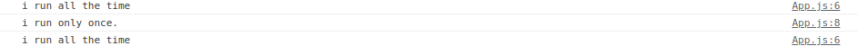

이와 같이 처음 한번만 실행된다.

그러면 다음과 같이 해보자.

```jsx
import { useEffect, useState } from "react";

function App() {
  const [counter, setValue] = useState(0);
  const [keyword, setKeyword] = useState("");
  const onClick = () => setValue((prev) => prev + 1);
  const onChange = (event) => setKeyword(event.target.value);
  console.log("i run all the time");
  useEffect(() => {
    console.log("CALL THE API....");
  }, []);
  console.log("Search for", keyword);
  return (
    <div>
      <input
        value={keyword}
        onChange={onChange}
        type="text"
        placeholder="Search here..."
      ></input>
      <h1>{counter}</h1>
      <button onClick={onClick}>Click Me!</button>
    </div>
  );
}

export default App;
```

이렇게 하면 어떻게 될까?

우리가 타이핑을 칠 때 마다 console.log("i run all the time") 해당 코드가 실행이 될 것이다.

검색 기능을 만들 것인데, 검색창에 무언가를 썻을 때, 검색 API를 이용하는 것이다.

오직 검색창에 무언가를 입력할 때만 실행시키고 싶고, 다른 것들은 실행 시키고 싶지 않다.

```jsx
useEffect(() => {
  console.log("Search For", keyword);
}, []);
```

이렇게 한다면 어떻게 될까?

처음에 rendering할 때 한번만 실행된다. 하지만, 우리는 keyword가 변화할 때만 코드를 실행하고 싶은 것이다.

그래서 이때 사용하는 것이 두번째 Argument이다.

두 번째 Argument의 기능은 **특정 코드가 변화할 때만 실행시키고 싶을 때 특정 코드를 넣어주면 된다.**

우리는 **keyword**가 변화할 때 코드를 실행시키고 싶은 것이니 다음과 같이 해주자.

```jsx
useEffect(() => {
  if (keyword !== "" && keyword.length > 5) {
    console.log("Search For", keyword);
  }
}, [keyword]);
```

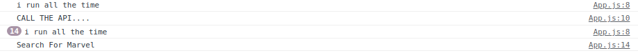

버튼을 눌를 때도 useEffect안에 설정해둔 함수는 rendering되지 않고 글자가 6글자가 되는 시점에 console창에서 확인할 수 있다.

### 3.1 useEffect - Cleanup function

**useEffect의 마지막 기능**을 배워보자.

```jsx
import { useEffect, useState } from "react";

function App() {
  const [showing, setShowing] = useState(false);
  const onClick = () => setShowing((prev) => !prev);
  return (
    <div>
      <button onClick={onClick}>{showing ? "Hide" : "Show"} </button>
    </div>
  );
}

export default App;
```

여기 까지 해보고, 무슨 compoenent를 보여줄지, 숨길지 결정할 것이다.

```jsx
		function Hello() {
			return <h1>Hello</h1>;
		}

	...

    <div>
      {showing ? <Hello /> : null}
      <button onClick={onClick}>{showing ? "Hide" : "Show"} </button>
    </div>

	...
```

이런식으로 해서 compoenent를 숨기거나 보여 줄 수 있다.

이번엔 Hello Component에 useEffect를 만들 것이다.

```jsx
import { useEffect, useState } from "react";

function Hello() {
  useEffect(() => {
    console.log("I'm here!");
  }, []);
  return <h1>Hello</h1>;
}

function App() {
  const [showing, setShowing] = useState(false);
  const onClick = () => setShowing((prev) => !prev);
  return (
    <div>
      {showing ? <Hello /> : null}
      <button onClick={onClick}>{showing ? "Hide" : "Show"} </button>
    </div>
  );
}

export default App;
```

이와 같이 하고 결과를 확인해 보자.

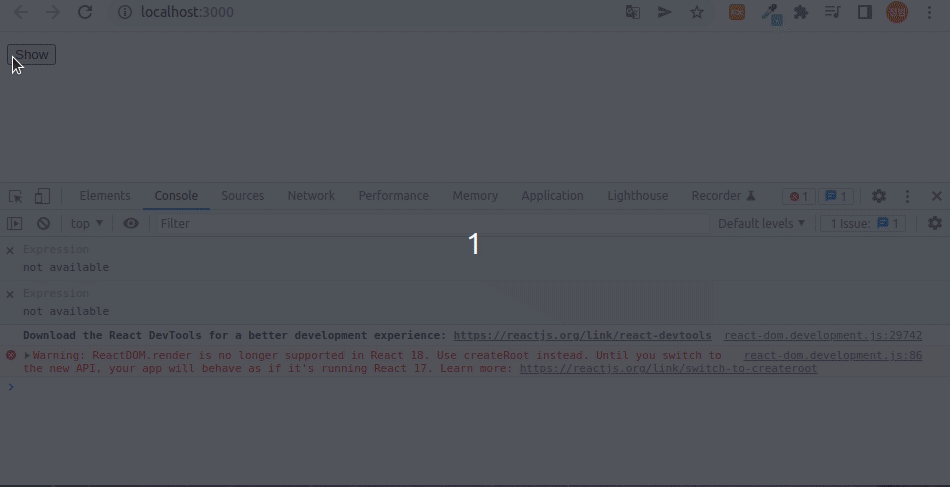

Hello component를 hide할 때는 말 그래도 **compoenent를 screen에서 지워주고 있다.**

그래서 다시 보여줄 때 console도 다시 작동하는 것이다.

**Component를 Hide를 하는 것이 아니라 destroy, create하고 있는 것**이다.

여기서 React JS 기능을 하나 사용할 수 있는데, Compoenent가 destroy될 때 사용하는 것이다. useEffect에서 return을 활용하면 된다.

```jsx
function Hello() {
  useEffect(() => {
    console.log("created :)");
    return () => console.log("destroyed :(");
  }, []);
  return <h1>Hello</h1>;
}
```

결과를 확인해 보자.

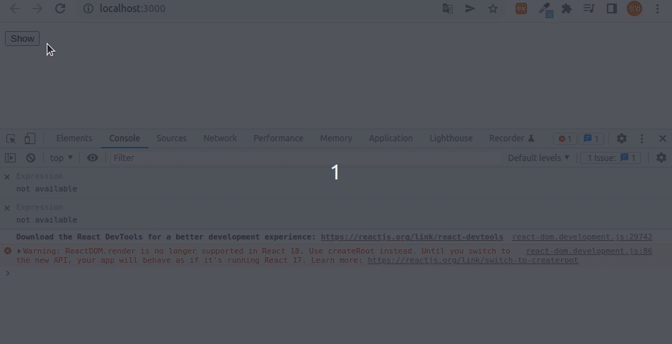

해당 코드에서

    return () => console.log("destroyed :(");

이 부분이 바로 **Cleanup Function**인 것이다.

Component가 지워질 때, event listener를 지우거나, 혹은 console창에 무언가를 보여주고 싶을 때 등등 여러 상황에서 활용할 수 있다.

```jsx
function Hello() {
  function byFn() {
    console.log("bye :(");
  }
  function hiFn() {
    console.log("created :)");
    return byFn;
  }
  useEffect(hiFn, []);
  return <h1>Hello</h1>;
}
```

이런식으로도 활용도 가능하다.

## 4. How to utilize React

이제 지금까지 배운 것을 총 정리, 복습하는 시간이다.

세 가지 미니 앱을 구현할 것이다.

1. **To Do List**
2. **Cryptocurrency Service**
3. **Movie Service**

### 4.1 To Do List

먼저 시작점 코드를 보자.

```jsx
// App.js

function App() {
  return (
    <div>
      <input type="text" placeholder="Write your to do..." />
    </div>
  );
}

export default App;
```

input을 컨트롤 할 수 있도록 만들어 줄것인데, 그때 쓰는 것은 **useState**이다.

그리고 버튼을 눌렀을 때 **submit 이벤트**를 발생 시킬 것이다.

```jsx
import { useState } from "react";

function App() {
  const [toDo, setToDo] = useState("");
  const onChange = (event) => setToDo(event.target.value);
  const onSubmit = (event) => {
    event.preventDefault();
    console.log(toDo);
  };
  return (
    <div>
      <form onSubmit={onSubmit}>
        <input
          onChange={onChange}
          value={toDo}
          type="text"
          placeholder="Write your to do..."
        />
        <button>Add To Do</button>
      </form>
    </div>
  );
}

export default App;
```

input이 비어있을 때는 실행시키고 싶지 않기 때문에, 조건문을 걸어두자.

```jsx
const onSubmit = (event) => {
  event.preventDefault();
  if (toDo === "") {
    return;
  }
  setToDo("");
};
```

**To Do List** 즉 우리는, Array를 받을 수 있도록 해줘야 한다.

toDos에 default값으로 빈 배열을 넣어두자.

    const [toDos, setToDos] = useState([]);

이제 to-do를 추가할 때 우리가 갖고있는 Array를 가져와서 넣어주면 된다.

만약, 이것이 일반적인 JavaScript였다면, 우리는 toDos.push를 사용했을 것이다.

하지만, **State를 직접적으로 수정할 수 없다는 것**

그래서 우리는 **Array를 직접적으로 수정하지 않으면서도 setToDo로 Array에 element를 추가하는 방법**을 사용할 것이다.

JavaScript에서 Array에 넣는 방식 두가지를 확인할 것이다.

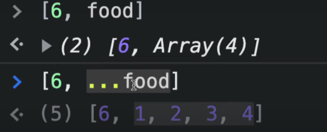

위의 방식은 Array안에 value를 넣어주면서 기존 Array그대로 들어가 버린다.

즉, [Number, Array]이러한 형태로 들어가는 것이다.

이것은 우리가 원하는 방식이 아니다.

그래서 Array안에 요소는 전부 Number로 넣어주기 위해서 아래의 방식을 사용할 것이다.

    setToDos(currentArray => [toDo, ...currentArray])

이제 구현을 할 것인데, **Array의 value들을 받아오는 map()함수**를 사용할 것이다.

```jsx
<hr />;
{
  toDos.map((item) => <li>{item}</li>);
}
```

이와 같이 하면 출력은 잘 된다. 하지만 결과를 봐보자.

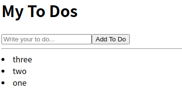

하지만, 문제는 console창에 보일 것이다.

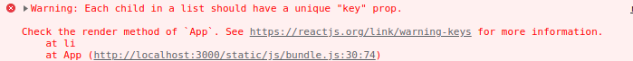

이런 오류가 왜 나왔는가?

**같은 Component의 list를 render할 때 key라는 prop을 넣어줘야 한다.**

왜냐면 react가 기본적으로 list에 있는 모든 item들을 인식하기 때문이다.

> **주의**
>
> key값은 unique해야 한다.

```jsx
<hr />;
{
  toDos.map((item, index) => <li key={indexs}>{item}</li>);
}
```

Array를 가져와서 그 Array의 item들을 변형해서 li가 되도록 한 것이다.

이렇게 구현이 완료 되었다.

### 4.2 Cryptocurrency Service

요번엔 암호화폐들과 가격들을 나열해 볼 것이다.

그러기 위해서 요번에 사용할 것은 **useEffect**이다.

페이지나 앱이 들어왔을 때 로딩 메세지가 보이고 코인들이 나열되면 로딩 메세지를 숨기고 코인들을 리스트로 보여줄 것이다.

처음 코드로 돌아가자.

```jsx
function App() {
  return <div></div>;
}
export default App;
```

먼저 여기서 **state**를 하나 만들어 줄 것인데 **loading**을 만들어 줄 것이다.

```jsx
import { useState } from "react";

function App() {
  const [loading, setLoding] = useState(true);
  return (
    <div>
      <h1>The Coins!</h1>
      {loading ? <strong>Loadding...</strong> : null}
    </div>
  );
}
export default App;
```

이제 **useEffect**를 사용해 보자.

다시 한번 기억해보자면, useEffect안에 넣는 것은 원할 때 한번 사용하는 것으로 활용한다.

```jsx
useEffect(() => {
  fetch("https://api.coinpaprika.com/v1/tickers");
}, []);
```

> 만약 fetch가 해당 url의 정보를 잘 가져오지 못한다면 너무 많은 데이터가 있어서 그럴 수 있다. 그럴 땐 **limit**를 사용하면 된다.
>
> ```html
> https://api.coinpaprika.com/v1/tickers?limit=10
> ```

이렇게 한 후, 가져올 정보들을 json으로 가져오자.

```jsx
useEffect(() => {
  fetch("https://api.coinpaprika.com/v1/tickers")
    .then((response) => response.json())
    .then((json) => console.log(json));
}, []);
```

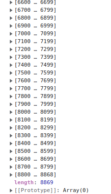

현재 저 json에 들어있는 정보는 coin에 관련된 정보들이다.

이 data를 우리의 component로 어떻게 보여 줄 수 있을까?

**useState**를 이용하면 된다.

```jsx
const [loading, setLoading] = useState(true);
const [coins, setCoins] = useState([]);
useEffect(() => {
  fetch("https://api.coinpaprika.com/v1/tickers")
    .then((response) => response.json())
    .then((json) => {
      setCoins(json);
      setLoading(false);
    });
}, []);
```

Array이기 때문에 **Array의 형태**로 들어갔을 것이며, 그때 **Component에서 사용하는 것**은 위에서도 봤듯이 **map()함수**이다.

```jsx
<div>
  <h1>The Coins! {loading ? "" : `(${coins.length})`}</h1>
  {loading ? (
    <strong>Loadding...</strong>
  ) : (
    <select>
      {coins.map((coin) => (
        <option>
          {coin.name} ({coin.symbol}): ${coin.quotes.USD.price} USD
        </option>
      ))}
    </select>
  )}
</div>
```

여기서 input을 추가해서 가지고 있는 달러로 얼마만큼의 코인으로 바꿀 수 있는지 출력해주는 코드를 구현해 보자.

또한 코인의 종류를 list의 형태로 하는 것이 아니라 **Select로 선택**하여 원하는 코인으로 환전하는 시스템을 만들자.

```jsx
import { useEffect, useState } from "react";

function App() {
  const [loading, setLoading] = useState(true);
  const [coins, setCoins] = useState([]);
  const [money, setMoney] = useState(0);
  const [selected, setSelected] = useState(1);

  useEffect(() => {
    fetch("https://api.coinpaprika.com/v1/tickers")
      .then((response) => response.json())
      .then((json) => {
        setCoins(json);
        setLoading(false);
      });
  }, []);
  const onExchange = (event) => {
    event.preventDefault();
    const value = event.target[0].value;
    if (value === "") {
      return;
    }
    setMoney(value);
    event.target[0].value = "";
  };
  const onSelected = (event) => {
    setSelected(event.target.value);
  };
  return (
    <div>
      <h1>The Coins! {loading ? "" : `(${coins.length})`}</h1>
      {loading ? (
        <strong>Loadding...</strong>
      ) : (
        <select name="coinName" onChange={onSelected}>
          {coins.map((coin, index) => (
            <option
              key={index}
              value={coin.quotes.USD.price}
              id={coin.symbol}
              symbol={coin.symbol}
            >
              {coin.name} ({coin.symbol}): ${coin.quotes.USD.price} USD
            </option>
          ))}
        </select>
      )}
      <form onSubmit={onExchange}>
        <input type="text" placeholder="How much are you?"></input>
        <button>Exchange!</button>
      </form>
      <hr />
      {money / selected !== 0 ? (
        <h3>You can exchange {money / selected}</h3>
      ) : null}
    </div>
  );
}
export default App;
```

여기서 **중요한 점**

**만약 select의 option에 정보들을 넣어주지 않으면 코인의 정보를 가져오는 것이 아니라 text로 받아온다.**

```jsx
const onSelected = (event) => {
  setSelected(event.target.value);
};
```

해당 코드를 가져올 때 text로 받아온다는 것이다.

```jsx
<select name="coinName" onChange={onSelected}>
  {coins.map((coin, index) => (
    <option>
      {coin.name} ({coin.symbol}): ${coin.quotes.USD.price} USD
    </option>
  ))}
</select>
```

option에 준 Props들(key, value, id, symbol)을 전부 지워보고 확인해보자.

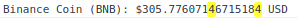

원하지 않는 형태인 String으로 받아온다. 주의하자.

### 4.3 Movie Service

이제 최종 미니 앱인 영화를 보여주고 그 영화들에 대한 정보들도 보여주면서 페이지 이동 까지 다뤄볼 예정이다.

초기 코드로 돌아가자.

```jsx
function App() {
  return <div></div>;
}
export default App;
```

이전 것과 동일하게 로딩이 되게 할 것이고, 로딩이 끝났을 때는 영화들을 보여 줄 것이다.

```jsx
import { useEffect, useState } from "react";

function App() {
  const [loading, setLoading] = useState(true);
  const [movies, setMovies] = useState([]);
  useEffect(() => {
    fetch(
      "https://yts.mx/api/v2/list_movies.json?minimum_rating=9&sort_by=year"
    )
      .then((response) => response.json())
      .then((json) => {
        setMovies(json.data.movies);
        setLoading(false);
      });
  }, []);
  console.log(movies);
  return <div>{loading ? <h1>Loading...</h1> : null}</div>;
}
export default App;
```

다시 한번 보자면, 만약 useEffect를 쓸 때 두번째 객체로 []를 안넣어준다면?

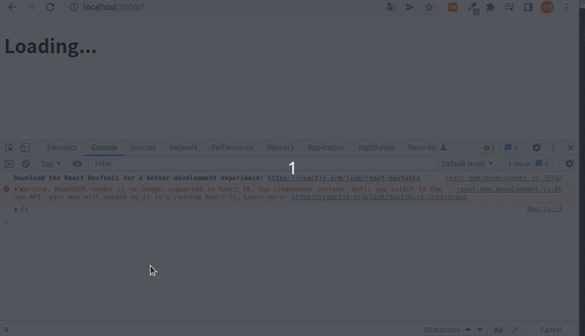

위와 같이 코드를 짤 수 있지만, 요번엔 async-await를 사용해보자.

```jsx
import { useEffect, useState } from "react";

function App() {
  const [loading, setLoading] = useState(true);
  const [movies, setMovies] = useState([]);
  const getMovies = async () => {
    const json = await (
      await fetch(
        "https://yts.mx/api/v2/list_movies.json?minimum_rating=9&sort_by=year"
      )
    ).json();
    setMovies(json.data.movies);
    setLoading(false);
  };
  useEffect(() => {
    getMovies();
  }, []);
  console.log(movies);
  return <div>{loading ? <h1>Loading...</h1> : null}</div>;
}
export default App;
```

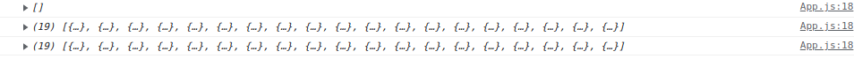

> **왜 두번을 받아 오나?**
>
> setMovies에서 한번 더 setLoading을 불러서 그렇다.

이제 Array에 Movie 정보들을 넣어줬으니 map()을 활용하면 되겠다.

이전 것과 다를 것이 없기에 코드로 보여주고 넘어가겠다.

```jsx
import { useEffect, useState } from "react";

function App() {
  const [loading, setLoading] = useState(true);
  const [movies, setMovies] = useState([]);
  const getMovies = async () => {
    const json = await (
      await fetch(
        "https://yts.mx/api/v2/list_movies.json?minimum_rating=9&sort_by=year"
      )
    ).json();
    setMovies(json.data.movies);
    setLoading(false);
  };
  useEffect(() => {
    getMovies();
  }, []);
  return (
    <div>
      {loading ? (
        <h1>Loading...</h1>
      ) : (
        <div>
          {movies.map((movie) => (
            <div key={movie.id}>
              <h3>{movie.title}</h3>
              
              <p>{movie.summary}</p>
              <ul>
                {movie.genres.map((g) => (
                  <li key={g}>{g}</li>
                ))}
              </ul>
            </div>
          ))}
        </div>
      )}
    </div>
  );
}
export default App;
```

### 4.3.1 Divided and Conquer

가독성을 높이기 위해 **Divided and Conquer**을 해주자.

```jsx
// src / Movie.js;

function Movie({ title, coverImg, summary, genres }) {
  return (
    <div>
      <h3>{title}</h3>
      
      <p>{summary}</p>
      <ul>
        {genres.map((g) => (
          <li key={g}>{g}</li>
        ))}
      </ul>
    </div>
  );
}

export default Movie;
```

현재 이 Movie Component는 Props를 부모 Component로부터 받아오고 있는 것이다.

```jsx
import { useEffect, useState } from "react";
import Movie from "./Movie";

function App() {
  const [loading, setLoading] = useState(true);
  const [movies, setMovies] = useState([]);
  const getMovies = async () => {
    const json = await (
      await fetch(
        "https://yts.mx/api/v2/list_movies.json?minimum_rating=9&sort_by=year"
      )
    ).json();
    setMovies(json.data.movies);
    setLoading(false);
  };
  useEffect(() => {
    getMovies();
  }, []);
  return (
    <div>
      {loading ? (
        <h1>Loading...</h1>
      ) : (
        <div>
          {movies.map((movie) => (
            <Movie
              key={movie.id}
              title={movie.title}
              coverImg={movie.medium_cover_image}
              summary={movie.summary}
              genres={movie.genres}
            />
          ))}
        </div>
      )}
    </div>
  );
}
export default App;
```

> **key값을 줘야 하는 것을 잊지말자.**
>
> key는 React JS에서만, map안에서 Compoennt들을 render할 때 사용한다.

이제 Movie Component에서 PropTypes를 설정해주자.

```jsx
...

Movie.propTypes = {
  coverImg: PropTypes.string.isRequired,
  title: PropTypes.string.isRequired,
  summary: PropTypes.string.isRequired,
  genres: PropTypes.arrayOf(PropTypes.string),
};
```

export하기 전에 해주면 된다.

### 4.3.2 React Router

현재 Home에서 페이지를 보고 있다면 URL이 movies/movie.id로 이동하는 것을 구현할 것이다.

먼저 Router를 사용할 수 있도록 설치해주자.

    npm i react-router-dom@5.3.0

> 강의 에선 Version 5.3을 쓰고 있지만 현재 react-router-dom은 V6이 넘어가면서 사용 방식이 바뀌었다. 아래의 페이지를 참고하자.
>
> 참고: [[React] react-router-dom v6 업그레이드 되면서 달라진 것들](https://velog.io/@soryeongk/ReactRouterDomV6)

이후 routes폴더를 만들고, 코드 정리를 해주자. 스크린 단위로 정리를 할 것이다.

**routes/Home.js**에 App.js에 있던 코드를 전부 옮겨 줄 것이다.

```jsx
// routes/Home.js

import { useEffect, useState } from "react";
import Movie from "../components/Movie";

function Home() {
  const [loading, setLoading] = useState(true);
  const [movies, setMovies] = useState([]);
  const getMovies = async () => {
    const json = await (
      await fetch(
        "https://yts.mx/api/v2/list_movies.json?minimum_rating=9&sort_by=year"
      )
    ).json();
    setMovies(json.data.movies);
    setLoading(false);
  };
  useEffect(() => {
    getMovies();
  }, []);
  return (
    <div>
      {loading ? (
        <h1>Loading...</h1>
      ) : (
        <div>
          {movies.map((movie) => (
            <Movie
              key={movie.id}
              title={movie.title}
              coverImg={movie.medium_cover_image}
              summary={movie.summary}
              genres={movie.genres}
            />
          ))}
        </div>
      )}
    </div>
  );
}

export default Home;
```

그리고 App.js에는 router를 render해줄 것이다.

router는 URL을 보고있는 component이다.

```jsx
// App.js

import { BrowserRouter as Router, Switch, Route } from "react-router-dom";

function App() {
  return (
    <Router>
      <Switch></Switch>
    </Router>
  );
}
export default App;
```

여기서 Switch의 역할은 Route를 찾는다.

그리고 Route를 찾으면 Component를 렌더링 할 것이다.

2개의 Route를 만들자.

```jsx
<Router>
  <Switch>
    <Route path="/movie">
      <Detail />
    </Route>
    <Route path="/">
      <Home />
    </Route>
  </Switch>
</Router>
```

> 만약 다른 동류 Router인 HashRouter를 사용한다면,
>
> 
>
> 이와 같이 #이 붙는다

좀 더 설명하고 넘어가자면,

**첫번째 Component**는 **Router**였다.

**Router**는 먼저 렌더링을 해주고 그 안에 들어가는 건 우리가 유저에게 보여주고 싶은 것들이다.

**Switch Compoenent**를 넣어준 **이유**는 한 번에 하나의 Route만 Rendering 하기 위함이다.

React Router에서는 원한다면 두 개의 Route를 한번에 렌더링 할 수 있어서 그렇다.

이제 페이지 이동을 구현해 보자.

Movie Compoennt로 가서 anchor를 달아도 되지만 그러면 페이지 전체가 재실행된다.

이것은 일반적인 자바스크립트에선 당연한 것이지만, React는 다르게 할 수 있다.

우리가 사용할 것은 **Link**이다.

**Link**는 브라우저 새로고침 엇이도 유저를 다른 페이지로 이동시켜주는 컴포넌트이다.

```jsx
Movie.js;

import { Link } from "react-router-dom";

<h3>
  <Link to="/movie">{title}</Link>
</h3>;
```

React Router는 Dynamic(동적) URL을 지원하기도 하는데, 이 말은 즉 URL에 변수를 넣을 수 있다는 것이다.

```jsx
<Route path="/movie/:id">
  <Detail />
</Route>
```

이렇게 하면 이제 Movie Component에서 유저를 **"/movie/(variable)"** 의 경로로 보낼 수 있다.

이렇게 되면, **Movie Compoennt에서는 id가 필요**로 하게 된다.

현재 Movie Compoennt에선 Props로 id를 받고 있지 않다.

Props는 부모 Component가 자식 Component한테 주는 것이라고 말했다.

Home()으로 가서 id prop을 건네주자.

```jsx
<div>
  {movies.map((movie) => (
    <Movie
      key={movie.id}
      id={movie.id}
      title={movie.title}
      coverImg={movie.medium_cover_image}
      summary={movie.summary}
      genres={movie.genres}
    />
  ))}
</div>
```

**PropTypes** 검사도 해주고, **Link**도 활용하자.

```jsx

<Link to={`/movie/$(id)`}>{title}</Link>
...

Movie.propTypes = {
  id: PropTypes.number.isRequired,

```

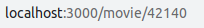

이와 같이 받았다. 저 id를 어떻게 받을 수 있을까?

그때 React Router에서 제공하는 함수가 있다.

바로 **useParams()** 이다.

**useParams()** 은 **url에 있는 값을 반환**해주는 함수이다.

```jsx
// Detail.js

import { useParams } from "react-router-dom";

function Detail() {
  const x = useParams();
  console.log(x);
  return <h1>Detail</h1>;
}

export default Detail;
```

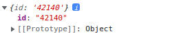

이제 id를 받았으니 fetch를 다시 이용할 수 있게 되었다.

```jsx
import { useEffect } from "react";
import { useParams } from "react-router-dom";

function Detail() {
  const { id } = useParams();
  const getMovie = async () => {
    const json = await (
      await fetch(`https://yts.mx/api/v2/movie_details.json?movie_id=${id}`)
    ).json();
    console.log(json);
  };
  useEffect(() => {
    getMovie();
  }, []);
  return <h1>Detail</h1>;
}

export default Detail;
```

결과는 다음과 같다.

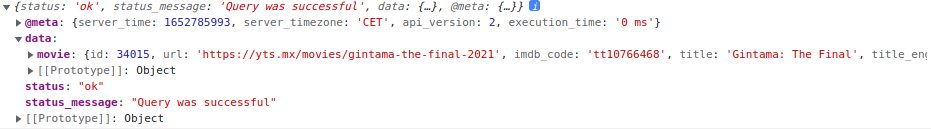

#### 4.3.3 Error Correction

현재 Movie Component를 받아서 인자로 건네주는 것을 하고있는데 오류가 나왔다.

```jsx
import { useEffect, useState } from "react";
import { useParams } from "react-router-dom";
import Movie from "../components/Movie";

function Detail() {
  const { id } = useParams();
  const [movie, setMovie] = useState();
  const getMovie = async () => {
    const json = await (
      await fetch(`https://yts.mx/api/v2/movie_details.json?movie_id=${id}`)
    ).json();
    setMovie(json.data.movie);
  };
  useEffect(() => {
    getMovie();
  }, []);
  console.log(
    movie.id,
    movie.background_image,
    movie.title,
    movie.genres,
    movie.description_full
  );
  return (
    <div>
      <h1>Detail</h1>
      <Movie
        key={movie.id}
        id={movie.id}
        title={movie.title}
        coverImg={movie.movie.background_image}
        summary={movie.description_full}
        genres={movie.genres}
      />
    </div>
  );
}

export default Detail;
```

무엇이 문제인지를 찾다가 Movie Component를 삭제하고 다음과 같이 해봤다.

```jsx
import { useEffect, useState } from "react";
import { useParams } from "react-router-dom";
import Movie from "../components/Movie";

function Detail() {
  const { id } = useParams();
  const [movie, setMovie] = useState();
  const getMovie = async () => {
    const json = await (
      await fetch(`https://yts.mx/api/v2/movie_details.json?movie_id=${id}`)
    ).json();
    setMovie(json.data.movie);
  };
  useEffect(() => {
    getMovie();
  }, []);
  console.log(movie);
  return (
    <div>
      <h1>Detail</h1>
    </div>
  );
}

export default Detail;
```

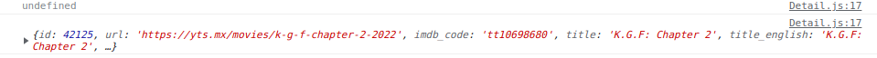

잘 받아온다. 하지만, Movie 컴포넌트를 넣는 순간 잘 안되었는데, 위의 코드를 실행 해보던 중 console창에서 처음에 undefined였다가 fetch가 다 된 순간 console창에 한번 뜨는 것을 알았다.

문제는 이거라고 생각한다.

undefined상태에서 Movie Component에 넘겨 버리니깐 오류가 나서 오류가 났다고 하면서 페이지 작동이 멈추는 것 같다. 그래서 다음과 같이 해주었다.

```jsx
import { useEffect, useState } from "react";
import { useParams } from "react-router-dom";
import Movie from "../components/Movie";

function Detail() {
  const { id } = useParams();
  const [loading, setLoading] = useState(true);
  const [movie, setMovie] = useState();
  const getMovie = async () => {
    const json = await (
      await fetch(`https://yts.mx/api/v2/movie_details.json?movie_id=${id}`)
    ).json();
    setMovie(json.data.movie);
    setLoading(false);
  };
  useEffect(() => {
    getMovie();
  }, [getMovie]);
  return (
    <div>
      {loading ? (
        <h1>Loding...</h1>
      ) : (
        <Movie
          key={movie.id}
          id={movie.id}
          title={movie.title}
          coverImg={movie.background_image}
          summary={movie.description_full}
          genres={movie.genres}
        />
      )}
    </div>
  );
}

export default Detail;
```

문제없이 작동한다.

## 5. Publishing

**배포**를 할 것인데, **gh-pages**를 이용할 것이다.

    npm i gh-pages

**gh-pages**는 **결과물을 github pages에 업로드 할 수 있게 해주는 패키지**이다.

즉 내 서버에서 확인할 수 있었던 **홈페이지를 깃허브를 통해서 확인**할 수 있다는 것이다.

설치 후, **가장 먼저 확인할 것은 package.json에 있는 scripts를 확인**하는 것이다.
